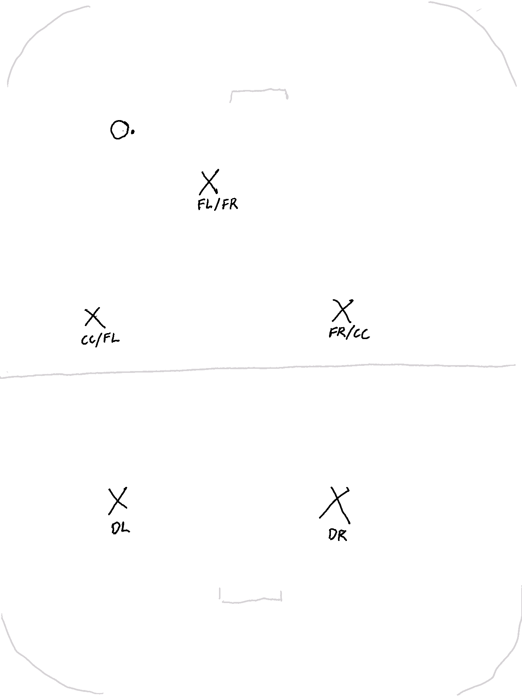
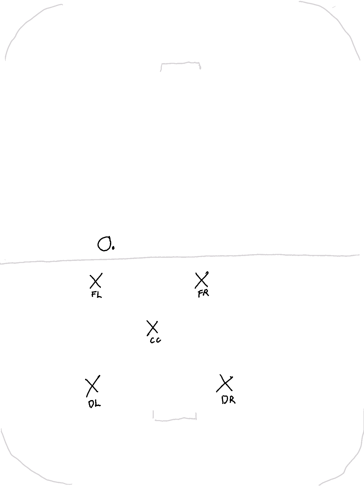
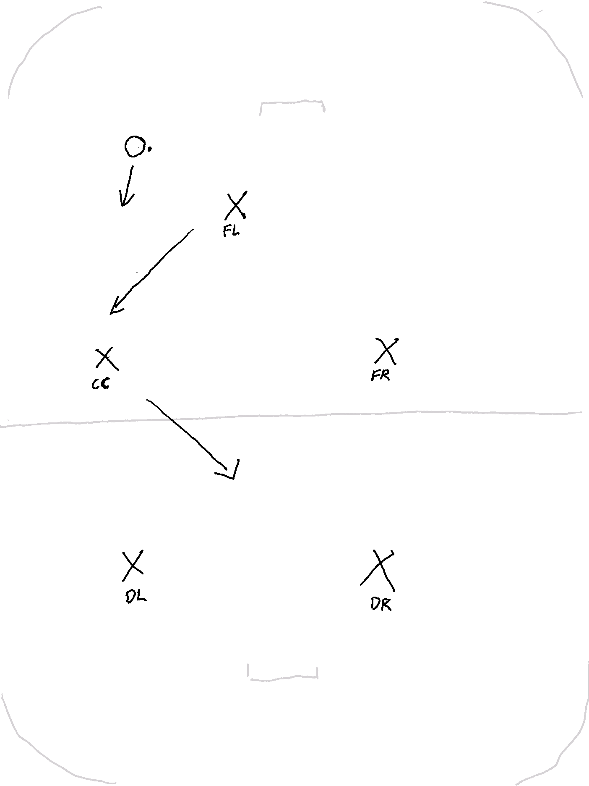
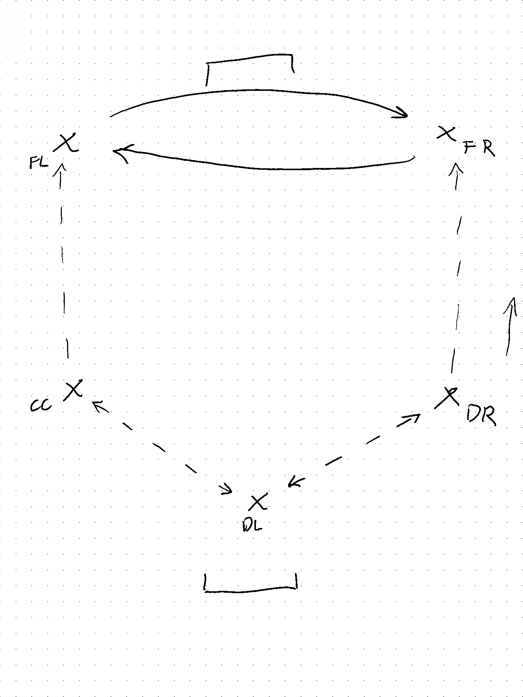
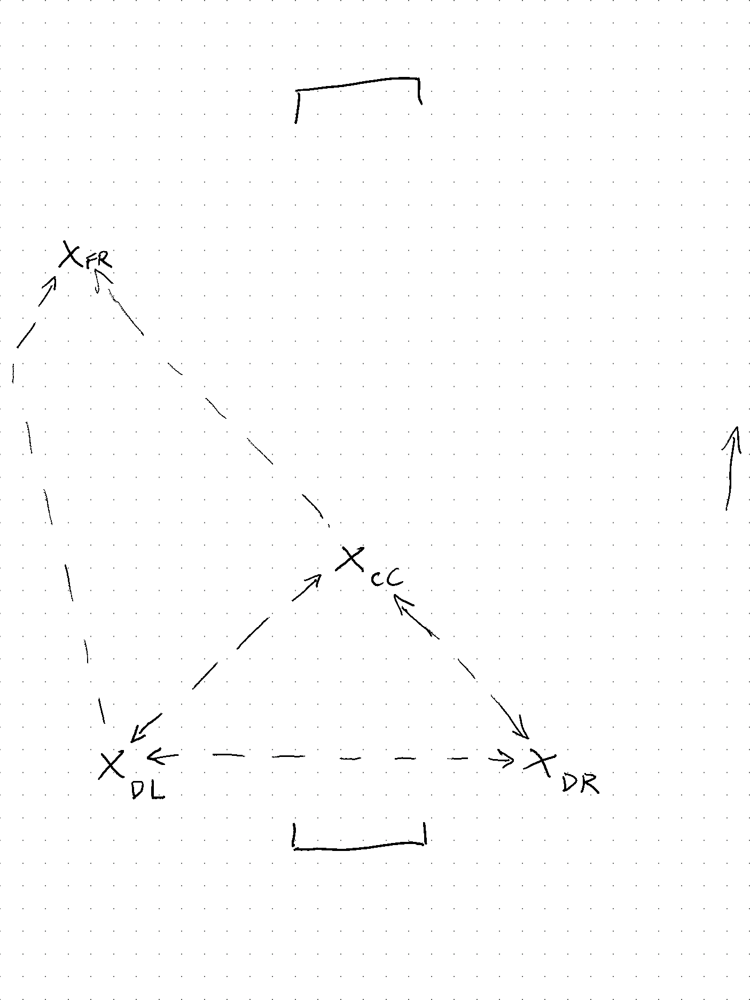

## Introduction

This document holds up-to-date information on all things Exclusive.

* [Training sign-up sheet](https://docs.google.com/spreadsheets/d/1-8pfj0shv6NbSPw79kbuiMgRmklzm7G7/edit#gid=595667172)
* [Match dates and times in Jödö league](https://www.jodo.ee/results-center)

## Line-ups
### Exclusive

| Name             | Position |
| ---------------- | -------- |
| Martin Einblau   |          |
| Heimar Kalpus    |          |
| Marko Raid       |          |
| Roman Rozbroj    |          |
| Silver Kerna     |          |
| Kristi Rickberg  |          |
| Kristjan Pint    |          |
| Raul Hanson      |          |
| Valentin Itsenko |          |
| Tanel Aruja      |          |
| Marek Poom       |          |
| Argo Jeletsky    |          |
| Sven Paulson     | GK       |

### 2-Exclusive

| Name            | Position |
| --------------- | -------- |
| Kimmo Lillipuu  |          |
| Martti Klesment |          |
| Kristo Klesment |          |
| Marti Laidre    |          |
| Mattias Oja     |          |
| Triinu Mustonen |          |
| Reimo Liiv      |          |
| Jaan Tarmak     |          |
| Liina Nöörlaid  |          |
| Kristo Busch    |          |
| Mikk Ventsel    |          |
| Karl Toomet     |          |
| Kaarel Tamme    |          |
| Brita Porovarde |          |
| Raido Kaasik    |          |
| Koit Kangur     |          |
| Denis Savсhenko | GK       |

## Formations

* FL is **F**orward **L**eft
* FR is **F**orward **R**ight
* CC is **C**enter
* DL is **D**efence **L**eft
* DR is **D**efence **R**ight

### Across-the-field defence: 1-2-2

The right forward will **always** be the top one. The center and the other forward will stay a bit lower.

### Own-side defence: 2-1-2

We play like the "5" on a die (täring).

### Transition from across-the-field to own-side defence

The center (CC) moves to... the center, and the right forward (FR) moves to the top right position, and we'll be back in the correct formation.

## Tactics

### Building the game

_When our defenders get the ball near our own goal, what do we do next?_

We don't rush the ball up immediately. Instead, the two defenders and center pass the ball in a triangle in the back, until they see an opportunity to pass up to one of the forwards.

The forwards don't stand still; they keep running around and switching sides to open up space.

The triangle moves around to get maximum free space. It can be inverted if there is enough space in the center: in this case the defenders are a bit lower and the center is the tip of the triangle:

